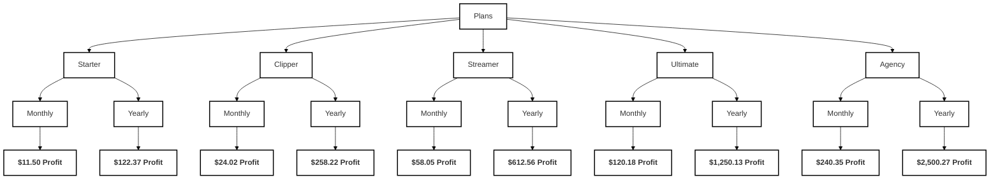

## Pricing Plans

| **Plan**    | **Monthly Price ($)** | **Yearly Price ($)** | **Clips/Month** | **FPS** | **Length (s)** | **Features**                                                                                             |
| ----------- | --------------------- | -------------------- | --------------- | ------- | -------------- | --------------------------------------------------------------------------------------------------------- |
| **Starter** | 12.99                 | 140.29               | 15              | 30      | 30             | - 30fps export quality - 30s video length - Auto-captioning                                      |
| **Clipper** | 29.99                 | 329.88               | 30              | 30      | 60             | - 30fps export quality - 60s video length - Auto-captioning                                      |
| **Streamer**| 69.99                 | 755.89               | 60              | 30      | 60             | - 30fps export quality - 60s video length - Auto-captioning                                      |
| **Ultimate**| 159.99                | 1,727.89             | 100             | 60      | 60             | - 60fps export quality - 60s video length - Auto-captioning                                      |
| **Agency**  | 319.98                | 3,455.78             | 200             | 60      | 60             | - 60fps export quality - 60s video length - Auto-captioning                                      |

## Profit Margins

### Monthly Profit Margin (%)

$\text{Profit Margin} = \left( \frac{\text{Monthly Profit}}{\text{Monthly Price}} \right) \times 100\%$

| **Plan**    | **Monthly Profit ($)** | **Monthly Price ($)** | **Profit Margin (%)** |
| ----------- | ---------------------- | --------------------- | --------------------- |
| **Starter** | 11.50                  | 12.99                 | 88.53%                |
| **Clipper** | 24.02                  | 29.99                 | 80.09%                |
| **Streamer**| 58.05                  | 69.99                 | 82.93%                |
| **Ultimate**| 120.18                 | 159.99                | 75.12%                |
| **Agency**  | 240.35                 | 319.98                | 75.09%                |

### Yearly Profit Margin (%)

$\text{Profit Margin} = \left( \frac{\text{Yearly Profit}}{\text{Yearly Price}} \right) \times 100\%$

| **Plan**    | **Yearly Profit ($)** | **Yearly Price ($)** | **Profit Margin (%)** |
| ----------- | --------------------- | -------------------- | --------------------- |
| **Starter** | 122.37                | 140.29               | 87.22%                |
| **Clipper** | 258.22                | 329.88               | 78.28%                |
| **Streamer**| 612.56                | 755.89               | 81.04%                |
| **Ultimate**| 1,250.13              | 1,727.89             | 72.36%                |
| **Agency**  | 2,500.27              | 3,455.78             | 72.35%                |

---

## Credit Calculation

- **Formula**:
  $\text{Credits per Clip} = \frac{\text{Width} \times \text{Height} \times \text{FPS} \times \text{Length (s)}}{100,000,000}$

- **Parameters**:
  - **Resolution**: 1280 x 720 (720p)
  - **Cost per Credit**: $0.012 (Based on purchasing 10,000 credits for $120 monthly)

---

## Cost Calculation

- **Cost per Credit**:
  $\text{Cost per Credit} = \frac{\$120}{10,000 \text{ credits}} = \$0.012$

- **Monthly Cost**:
  $\text{Monthly Cost} = \text{Monthly Credits} \times \$0.012$

- **Yearly Cost**:
  $\text{Yearly Cost} = \text{Yearly Credits} \times \$0.012$

---

## Profit Calculation

- **Monthly Profit**:
  $\text{Monthly Profit} = \text{Monthly Price} - \text{Monthly Cost}$

- **Yearly Profit**:
  $\text{Yearly Profit} = \text{Yearly Price} - \text{Yearly Cost}$

---

